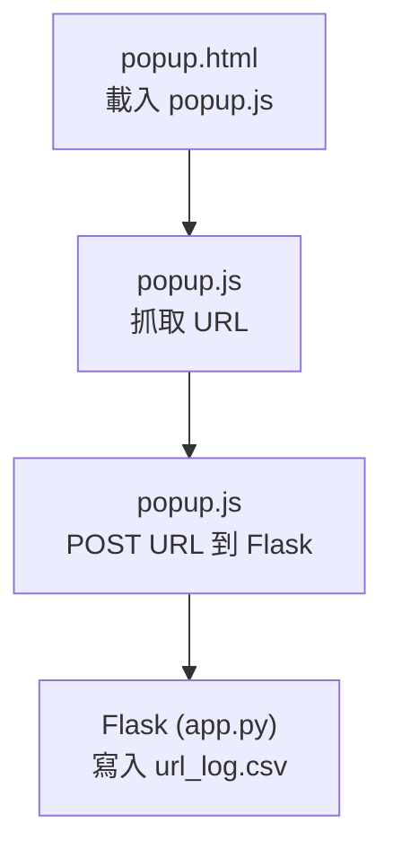

# fake-news-detector

新聞媒體辨識專題

[Flask 教學網址](https://devs.tw/post/448)

```mermaid
flowchart TD
    A["popup.html<br>載入 popup.js"] --> B["popup.js<br>抓取 URL"]
    B --> C["popup.js<br>POST URL 到 Flask"]
    C --> D["Flask (app.py)<br>寫入 url_log.csv"]
```
