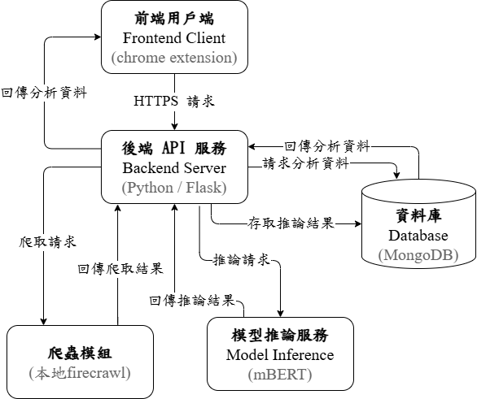
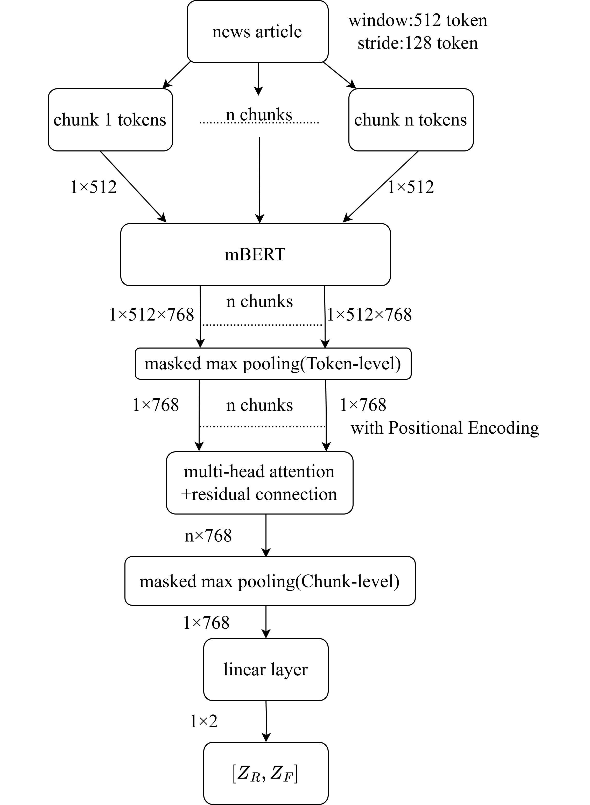

# 基於階層式 mBERT 與可解釋性 AI 之假新聞即時辨識 Chrome 擴充套件
**A Real-Time Fake News Detection Chrome Extension Based on Hierarchical mBERT and Explainable AI**


---

本專題實作一套可嵌入日常瀏覽情境的假新聞輔助辨識系統。使用者在網頁中 hover 到新聞 URL 後，Chrome 擴充套件會在低干擾的提示框中顯示該連結的風險摘要；若需要更多資訊，也可以開啟側邊欄查看模型判斷結果、候選可疑句段與文章內容標示。

系統核心結合 Chrome Extension、Flask API、MongoDB、Firecrawl 爬蟲流程，以及階層式 mBERT 長文本分類模型，目標是在使用者閱讀新聞或接觸可疑連結的當下，提供即時、可理解的輔助判斷。

## 專題資訊

| 項目 | 內容 |
|---|---|
| 學校 | 國立聯合大學 |
| 系所 | 資訊工程學系 |
| 班級 | 112 級大學部資工三甲 |
| 專題題目 | 基於階層式 mBERT 與可解釋性 AI 之假新聞即時辨識 Chrome 擴充套件 |
| 英文題目 | A Real-Time Fake News Detection Chrome Extension Based on Hierarchical mBERT and Explainable AI |
| 指導教師 | 温育瑋 博士 |
| 組長 | 范文爾 U1224030 |
| 組員 | 毛彥霖 U1224029、蘇景賢 U1224041 |

## 研究動機

假新聞與錯假資訊會透過社群平台、通訊軟體與新聞網站快速擴散。傳統事實查核平台通常需要使用者主動複製文章並搜尋查核結果，流程較繁瑣，也難以在閱讀當下即時提醒。

因此，本專題希望將查核流程融入使用者原本的瀏覽行為：當使用者查看網頁連結時，系統能自動擷取 URL、查詢資料庫、必要時觸發爬蟲與模型推論，最後以提示框和側邊欄呈現輔助判斷結果，降低誤信與轉傳不實資訊的風險。

## 系統功能

- URL hover 即時提示：使用者 hover 連結超過 200ms 後，顯示該 URL 的風險摘要。
- 非侵入式 UI：提示框以 URL 元件為 anchor 定位，避免遮擋主要閱讀內容。
- 詳細資訊側邊欄：顯示 URL 分析結果、模型信心程度、候選可疑句段與文章內容。
- 可疑句段標示：將模型內部訊號評分較高的候選句段對應回原文位置，輔助使用者理解模型輸出。
- MongoDB 快取與去重複：已分析過的 URL 會儲存於資料庫，減少重複爬取與推論成本。
- Firecrawl 動態網頁擷取：處理 JavaScript 動態載入內容，提升新聞正文擷取完整度。
- 階層式 mBERT 長文本分類：將長篇新聞切成多個 chunk，透過階層式架構進行真偽判斷。
- 機率校準：透過 Temperature Scaling、NLL 與 ECE 評估模型信心分數，使前端提示更可靠。

## 系統架構
<div align="center">
  
</div>

## 模型架構設計 (Hierarchical mBERT)

為了解決 mBERT 單次輸入 512 tokens 的長度限制，本系統設計了**階層式滑動視窗架構**。透過在 mBERT 之上堆疊額外的多頭自注意力層，不僅保留了長篇新聞後段的語境，更有效捕捉了不同段落間的潛在矛盾。

<div align="center">
  
</div>


## 成果畫面

### Hover 提示框

使用者 hover 到 URL 後，前端會顯示提示框並向後端請求摘要資訊。若只是快速滑過連結，系統不會送出請求，避免產生不必要的後端負擔。


### 側邊欄詳細資訊

點擊「查看詳情」後，Chrome 右側會開啟 Side Panel，顯示更完整的模型分析資訊與候選句段。


### 原文模糊比對與醒目提示

系統會將模型輸出的候選句段對應回爬取到的原文內容，讓使用者快速定位模型可能關注的文章區域。


### 可疑句段互動效果

使用者 hover 可疑句段時，前端會產生懸浮效果，並可點擊跳轉到下方文章內容的對應位置。


## 影片與相關連結

| 類型 | 連結 |
|---|---|
| Demo 影片 | https://www.youtube.com/watch?v=wxfsOjTkmXA |
| 專題簡報 | https://canva.link/jlb67pyrjgrwlih |
| 專題成果報告 | https://365nuu-my.sharepoint.com/:w:/g/personal/m1424005_o365_nuu_edu_tw/IQD-LrN2faecRIh8QUGBHX88Adg066KOFxRW6rALUsiKQyY |
| 專題精簡論文 | https://365nuu-my.sharepoint.com/:w:/g/personal/m1424005_o365_nuu_edu_tw/IQAonCrX6qBLSbFmpdZFZ7fgATQbL_A9roQkCJAIRqgEX8M |
| GitHub Repository | https://github.com/wen22-erh/fake-news-detector.git |

## 專案目錄

```text
.
├── testing_mbert/          # mBERT 推論與模型相關程式
├── inferencepipeline/      # 爬取、匯出、前處理、推論、寫入 MongoDB 的 pipeline
├── crawler/                # Firecrawl worker 與爬蟲流程
├── fake-news-detector/     # Flask backend 與 Chrome Extension
├── docs/assets/            # README 使用的成果截圖
├── requirements.txt        # Python 依賴
├── .env.example            # 環境變數範例
└── README.md
```

## 技術使用

- Frontend：Chrome Extension Manifest V3、Content Script、Background Service Worker、Side Panel
- Backend：Flask REST API
- Database：MongoDB
- Crawler：Firecrawl、URL normalization、domain rules、retry/backoff
- NLP / ML：PyTorch、Transformers、mBERT、階層式長文本分類
- Explainability：模型內部訊號候選句段、LIME 對照實驗
- Calibration：Temperature Scaling、Negative Log-Likelihood、Expected Calibration Error

## 安裝與環境建置

建立並啟動本機端的 Python 虛擬環境:

```bash
python -m venv .venv
source .venv/bin/activate
pip install -r requirements.txt
```
設定環境變數：

```bash
cp .env.example .env
```

請編輯 .env 檔案，填入您的 MongoDB 連線字串、模型路徑、以及 Firecrawl 爬蟲等相關金鑰設定。

## 執行推論管線

執行完整的爬蟲與推論流程:

```bash
python inferencepipeline/run_all.py
```

略過爬蟲，僅對既有資料進行推論:

```bash
python inferencepipeline/run_all.py --skip-crawl
```

## 啟動擴充套件與後端服務

系統的 Flask API 與 MongoDB 管理位於 fake-news-detector/backend 目錄下。詳細的後端啟動與 Docker 執行說明，請參閱該目錄下的 README.md。

## Chrome 擴充套件安裝 (開發人員模式)
- 打開 Chrome 瀏覽器，網址列輸入 chrome://extensions/

- 開啟右上角的「開發人員模式」

- 點擊左上角的「載入未封裝項目」

- 選擇本專案中的擴充套件資料夾（如 fake-news-detector/extension），即可完成安裝並開始測試。

## GitHub Notes

This repository intentionally ignores local secrets, virtual environments, generated CSV/JSONL outputs, crawler results, model checkpoints, packaged extensions, and third-party cloned source such as `firecrawl/`.
